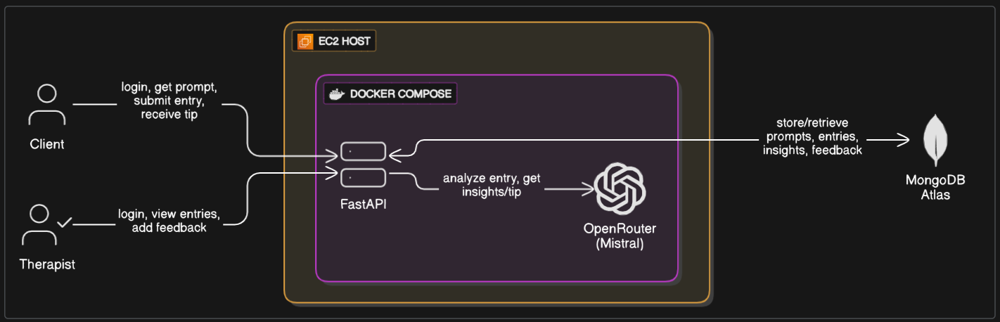

# Between.The.Sessions
> *“Helping clients reflect. Helping therapists stay in sync.”*  

---
### 🔗 **Live demo** (EC2 hosted – HTTP only): `http://ec2-3-82-229-226.compute-1.amazonaws.com:8000/`
### (Note: Voice mode doesn't work with live url due to lack of https connectio)
## 🚀 Key Features

- 📝 **Voice or Text Journaling** – Clients can submit daily reflections using voice or text
- 🤖 **AI Summaries & Insights** – Each entry is summarized by AI, highlighting key emotions, topics, and patterns
- 🧑‍⚕️ **Therapist Feedback for Every Entry** – Therapists can review and respond to each journal entry
- 📊 **Emotional & Behavioral Stats** – See trends like most common emotions, journaling frequency, and more

---

## ⚙️ Setup & Installation

### 1. Clone the Repo  
```bash
git clone https://github.com/Goutham-10/therapy-assist-niti-ai.git
cd therapy-assist-niti-ai
```

### 2. Add `.env` File

```bash
cp .env.example .env
```

Update the `.env` file with your keys:

```
OPENROUTER_API_KEY=your_key_here
OPENROUTER_MODEL=mistralai/mixtral-8x7b-instruct
MONGO_URI=your_mongo_atlas_uri
THERAPIST_SECRET_KEY=your_therapist_secret
```

### 3. Run with Docker Compose

```bash
docker-compose up --build
```

* App runs on: `http://localhost:8000`
* On EC2: open port `8000` in your AWS security group

---

## 📡 API Reference

| Method | Route              | Description                               |
| ------ | ------------------ | ----------------------------------------- |
| POST   | `/analyze`         | Analyze journal entry & generate insights |
| GET    | `/prompt`          | Get daily rotating psychological prompt   |
| GET    | `/log`             | Recent journal entries                    |
| GET    | `/log/{user_id}`   | Specific user’s journal history           |
| GET    | `/stats/{user_id}` | Summary stats for a user                  |
| POST   | `/feedback`        | Therapist feedback on entries             |
| POST   | `/therapist-login` | Therapist login via secret key            |

---

## 🧠 Architecture


---

## ☁️ EC2 Deployment

* Hosted on **AWS EC2 Free Tier**
* Docker + Docker Compose for infrastructure
* SSH-based CI/CD with `deploy.sh`
* 🔓 No HTTPS due to lack of custom domain (microphone access limitations acknowledged)

---

## 🔁 CI/CD Pipeline

* GitHub Actions pushes to `main`
* Auto-deploys via `ssh` + `deploy.sh`:

  * Pulls latest changes
  * Rebuilds and restarts containers
  * Logs any failures

---

## 📐 Engineering Tradeoffs

* 🧪 **No React** – UI built using plain **HTML + TailwindCDN + JavaScript**
* ✍️ Prompts written with a therapeutic tone — drawing from ACT, CBT, and journaling practices
* 🧠 Prompt rotation stored locally (`prompt_tracker.json`) – not Git-tracked
* 🧩 **FastAPI** used for async capability and readable API structure
* 🎯 Focused MVP – scoped to two roles with minimal dependencies

---

## ✅ Testing

* **Manual test coverage:**

  * Analyze endpoint (edge cases + normal entries)
  * Prompt rotation
  * Therapist feedback flow
* Early unit tests added in `/tests` (e.g., prompt reuse, short-entry check)

---

## 📈 Future Plans

* 🛡️ **HTTPS support** via Let's Encrypt (once domain is set up)
* 📱 Mobile-responsive redesign
* 📊 Emotion graphing over time
* 👥 Therapist onboarding + OTP login
* 🧠 Suggestion engine for therapist feedback
* 📴 Local offline journaling fallback

---

## 📂 Folder Structure

```bash
therapy-assist-niti-ai/
├── backend/
│   ├── main.py
│   ├── analyzer.py
│   ├── utils.py
├── frontend/
│   ├── index.html
│   └── therapist.html
├── prompts/
│   └── daily_prompts.json
├── docker-compose.yml
├── Dockerfile
├── deploy.sh
└── README.md
```

---

## 👨‍💻 Author

**Goutham A**  
CS Undergrad 
✉️ [Reach out on LinkedIn](https://www.linkedin.com/in/goutham-a-144774246/) or raise an issue in the repo
